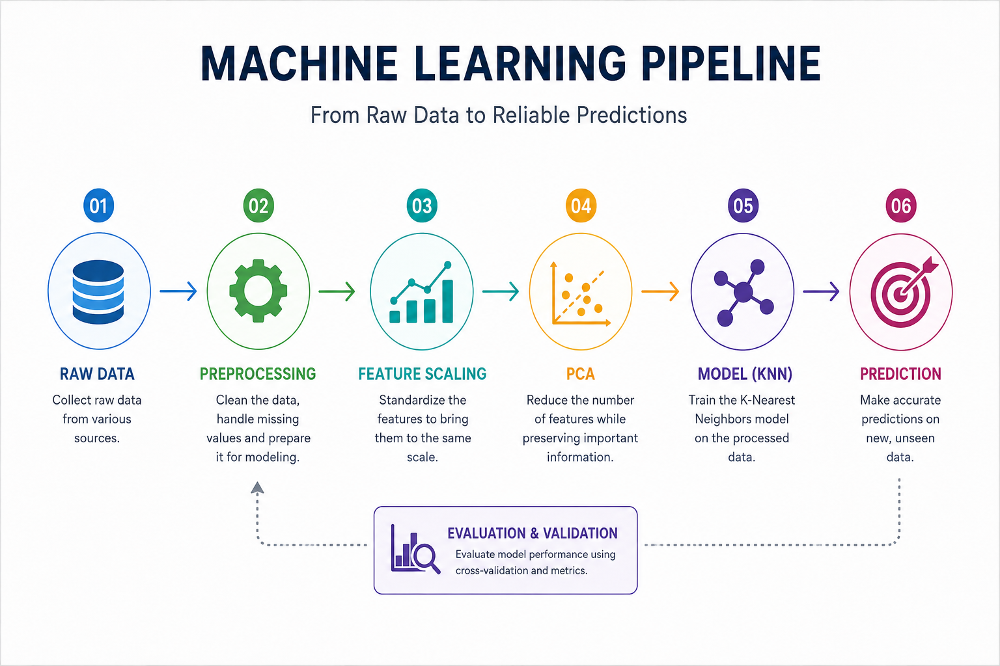

# 🚀 Machine Learning Model Validation and Pipelines


---

# 📌 Project Overview

This repository documents my hands-on journey of learning Machine Learning Model Evaluation using Scikit-Learn.

The project demonstrates how to build reliable machine learning models by applying proper validation techniques, preventing overfitting, reducing data leakage, creating machine learning pipelines, and optimizing models using GridSearchCV.

The repository contains notes, Jupyter notebooks, experiment outputs, and visualizations created during my learning process.

---

## Machine Learning Pipeline

This diagram shows the complete machine learning workflow used in this project.

<p align="center">
  
</p>

# 🎯 Learning Objectives

During this project I learned:

✅ Model Validation

✅ Training, Validation and Test Sets

✅ Generalization

✅ Overfitting

✅ Underfitting

✅ Cross Validation

✅ K-Fold Cross Validation

✅ Stratified Cross Validation

✅ Ridge Regression

✅ Lasso Regression

✅ Regularization

✅ Feature Selection

✅ Data Leakage

✅ Machine Learning Pipelines

✅ StandardScaler

✅ Principal Component Analysis (PCA)

✅ K-Nearest Neighbors (KNN)

✅ Hyperparameter Tuning

✅ GridSearchCV

---

# 📂 Repository Structure

```
Machine-Learning-Model-Validation-and-Pipelines/

│

├── datasets/

├── images/

├── notebooks/

├── notes/

├── results/

│

├── requirements.txt

├── LICENSE

└── README.md
```

---

# 🧠 Topics Covered

## Model Validation

- Train/Test Split
- Validation Set
- Generalization
- Overfitting
- Underfitting

---

## Cross Validation

- K-Fold Cross Validation
- Stratified Cross Validation

---

## Regularization

- Linear Regression
- Ridge Regression
- Lasso Regression
- Feature Selection

---

## Data Leakage

- Leakage Examples
- Prevention Techniques
- Time Series Validation

---

## Machine Learning Pipelines

- StandardScaler
- PCA
- KNN
- Pipeline
- Automatic Workflow

---

## Hyperparameter Tuning

- GridSearchCV
- Cross Validation
- Best Parameter Selection

---

# 📊 Project Workflow

Raw Data

↓

Data Preprocessing

↓

StandardScaler

↓

PCA

↓

Machine Learning Model

↓

Cross Validation

↓

GridSearchCV

↓

Best Model

↓

Prediction

↓

Evaluation

---

# 📈 Technologies Used

- Python

- NumPy

- Pandas

- Matplotlib

- Seaborn

- Scikit-Learn

- Jupyter Notebook

---

# 📷 Project Visualizations

Examples included in this repository:

- Pipeline Workflow

- PCA Visualization

- Confusion Matrix

- KNN Classification

- Regularization Comparison

- Feature Importance

- GridSearchCV Results

---

# 📚 Learning Outcome

This project helped me understand:

- How machine learning models generalize.

- Why overfitting happens.

- Why validation is necessary.

- How Cross Validation improves reliability.

- Why Lasso can perform feature selection.

- How Data Leakage affects model performance.

- How Pipelines simplify machine learning workflows.

- How GridSearchCV finds the best hyperparameters automatically.

---

# 💻 Installation

Clone this repository

```bash
git clone https://github.com/YOUR_USERNAME/Machine-Learning-Model-Validation-and-Pipelines.git
```

Install required libraries

```bash
pip install -r requirements.txt
```

Launch Jupyter Notebook

```bash
jupyter notebook
```

---

# ⭐ Future Improvements

- Add Decision Trees

- Random Forest

- Support Vector Machines

- Logistic Regression

- Neural Networks

- Model Deployment

---

# 👨‍💻 Author

**Hamza**

Physics Graduate | Machine Learning Learner | AI Enthusiast

Currently learning Machine Learning, AI Automation, and Data Science using Python and Scikit-Learn.

---

If you found this repository useful, consider giving it a ⭐.
